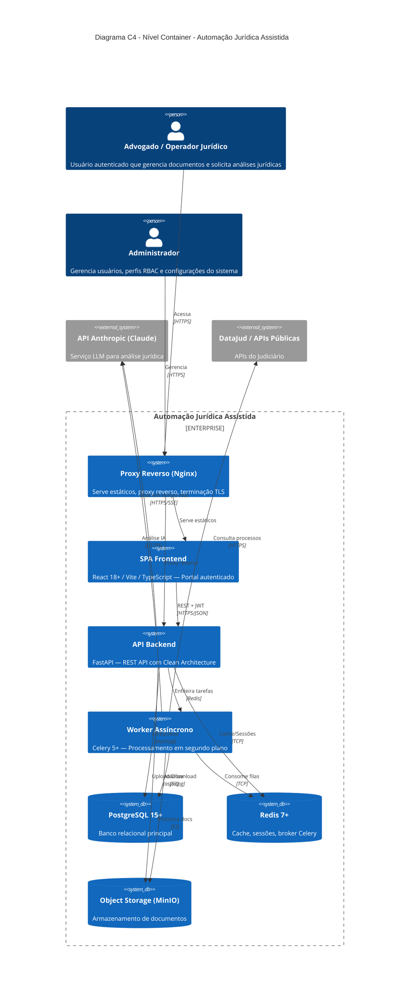

# Diagrama C4 — Nível Container

## Automação Jurídica Assistida

Este documento descreve a arquitetura do sistema no nível de **Container** do modelo C4,
detalhando os principais containers (aplicações, serviços, armazenamentos) e suas interações.

---

## 1. Visão Geral

O sistema **Automação Jurídica Assistida** segue uma arquitetura de **Monólito Modular com Clean Architecture**,
composta pelos seguintes containers principais:

| Container | Tecnologia | Descrição |
|-----------|-----------|----------|
| **SPA (Frontend)** | React 18+ / Vite / TypeScript | Portal autenticado para usuários jurídicos |
| **API Backend** | Python 3.11+ / FastAPI | REST API com lógica de negócio e orquestração |
| **Banco de Dados** | PostgreSQL 15+ | Armazenamento relacional principal |
| **Cache / Broker** | Redis 7+ | Cache de sessões, rate limiting e broker Celery |
| **Object Storage** | MinIO / S3-compatible | Armazenamento de documentos jurídicos |
| **Serviço LLM** | API Anthropic (Claude) | Análise inteligente de documentos jurídicos |
| **Worker Assíncrono** | Celery 5+ | Processamento de tarefas em segundo plano |
| **Proxy Reverso** | Nginx | Servidor de estáticos e proxy reverso |

---

## 2. Diagrama C4 Container (PlantUML)

```plantuml
@startuml C4_Container_AutomacaoJuridica
!include https://raw.githubusercontent.com/plantuml-stdlib/C4-PlantUML/master/C4_Container.puml

title Diagrama C4 - Nível Container - Automação Jurídica Assistida

Person(advogado, "Advogado / Operador Jurídico", "Usuário autenticado que\ngerencia documentos e\nsolicita análises jurídicas")

Person(admin, "Administrador", "Gerencia usuários, perfis\nRBAC e configurações\ndo sistema")

System_Boundary(sistema, "Automação Jurídica Assistida") {

    Container(nginx, "Proxy Reverso", "Nginx", "Serve arquivos estáticos do SPA,\nproxy reverso para a API,\nterminação TLS e headers de segurança")

    Container(spa, "SPA Frontend", "React 18+ / Vite / TypeScript", "Portal autenticado com\nformulários jurídicos complexos,\nupload de documentos,\nchat com assistente IA e\nvisualização de análises")

    Container(api, "API Backend", "Python 3.11+ / FastAPI", "REST API com Clean Architecture.\nMódulos: auth, users, documents,\nanalysis, chat, audit.\nValidação Pydantic v2,\nautenticação JWT + MFA,\nrate limiting e logs estruturados")

    Container(worker, "Worker Assíncrono", "Celery 5+ / Python", "Processamento de tarefas\nassíncronas: análise de documentos,\nchamadas ao LLM, indexação\nvetorial e notificações")

    ContainerDb(db, "Banco de Dados", "PostgreSQL 15+", "Armazenamento relacional:\nusuários, documentos (metadados),\nanálises, trilha de auditoria,\nsessões e configurações RBAC")

    ContainerDb(redis, "Cache / Broker", "Redis 7+", "Cache de sessões JWT,\nrate limiting (slowapi),\nresultados temporários,\nbroker de mensagens Celery\ne pub/sub para notificações")

    ContainerDb(storage, "Object Storage", "MinIO / S3-compatible", "Armazenamento de arquivos:\ndocumentos jurídicos originais,\nversões processadas,\nexportações e anexos")

}

System_Ext(anthropic, "API Anthropic (Claude)", "Serviço externo de LLM\npara análise inteligente\nde documentos jurídicos,\ngeração de resumos e\nassistente conversacional")

System_Ext(datajud, "DataJud / APIs Públicas", "APIs públicas do Judiciário\npara consulta de processos,\nandamentos e jurisprudência")

' === Relacionamentos do Advogado ===
Rel(advogado, nginx, "Acessa o portal", "HTTPS")

' === Relacionamentos do Administrador ===
Rel(admin, nginx, "Gerencia o sistema", "HTTPS")

' === Nginx -> SPA e API ===
Rel(nginx, spa, "Serve arquivos estáticos", "HTTP")
Rel(nginx, api, "Proxy reverso para API", "HTTP (interno)")

' === SPA -> API ===
Rel(spa, api, "Requisições REST autenticadas", "HTTPS / JSON\nJWT Bearer Token")

' === API -> Dependências internas ===
Rel(api, db, "Lê e escreve dados", "SQLAlchemy 2.0 + asyncpg\nTCP/5432")
Rel(api, redis, "Cache, sessões e rate limiting", "redis-py async\nTCP/6379")
Rel(api, storage, "Upload/download de documentos", "S3 Protocol\nHTTP/9000")
Rel(api, worker, "Enfileira tarefas assíncronas", "Celery via Redis\nAMQP-like")

' === Worker -> Dependências ===
Rel(worker, db, "Atualiza status de tarefas", "SQLAlchemy 2.0\nTCP/5432")
Rel(worker, redis, "Consome filas de tarefas", "Celery broker\nTCP/6379")
Rel(worker, storage, "Processa documentos armazenados", "S3 Protocol\nHTTP/9000")
Rel(worker, anthropic, "Envia documentos para análise IA", "HTTPS / REST\nSDK Anthropic + httpx\ncom retry (tenacity)")
Rel(worker, datajud, "Consulta processos e andamentos", "HTTPS / REST")

' === API -> Serviços externos (chamadas síncronas leves) ===
Rel(api, anthropic, "Chat conversacional em tempo real", "HTTPS / REST\nStreaming SSE")

LAYOUT_WITH_LEGEND()

@enduml
```

---

## 3. Diagrama C4 Container (Mermaid)

Para visualização direta em plataformas que suportam Mermaid (GitHub, GitLab, etc.):



---

## 4. Descrição Detalhada dos Containers

### 4.1 SPA Frontend (React)

| Aspecto | Detalhe |
|---------|---------|
| **Tecnologia** | React 18+, Vite 5+, TypeScript 5+ |
| **Responsabilidade** | Interface do usuário — portal autenticado |
| **Funcionalidades** | Login com MFA, gestão de documentos, upload de arquivos, visualização de análises, chat com assistente IA, painel administrativo |
| **Comunicação** | REST API via Axios/ky com interceptors JWT |
| **Bibliotecas-chave** | React Hook Form + Zod, TanStack Query, React Router v6, Tailwind CSS/Chakra UI, react-dropzone |
| **Segurança** | Guards de rota, tokens JWT em memória (não localStorage), CSP headers via meta tags, sanitização de inputs |
| **Deploy** | Build estático servido pelo Nginx |

### 4.2 Proxy Reverso (Nginx)

| Aspecto | Detalhe |
|---------|---------|
| **Tecnologia** | Nginx (última versão estável) |
| **Responsabilidade** | Terminação TLS, servir SPA, proxy reverso para API |
| **Funcionalidades** | Roteamento `/api/*` → FastAPI, `/*` → SPA estática, headers de segurança (HSTS, CSP, X-Frame-Options), compressão gzip/brotli |
| **Segurança** | Terminação TLS 1.3, rate limiting básico (complementar ao slowapi), ocultação de headers de servidor |

### 4.3 API Backend (FastAPI)

| Aspecto | Detalhe |
|---------|---------|
| **Tecnologia** | Python 3.11+, FastAPI 0.100+ |
| **Responsabilidade** | Lógica de negócio, autenticação, autorização, orquestração |
| **Arquitetura interna** | Clean Architecture (Ports & Adapters) |
| **Módulos** | `auth`, `users`, `documents`, `analysis`, `chat`, `audit` |
| **Comunicação** | REST JSON, OpenAPI automático, JWT RS256 |
| **Bibliotecas-chave** | Pydantic v2, SQLAlchemy 2.0 + asyncpg, python-jose/PyJWT, pyotp, slowapi, structlog, passlib[bcrypt] |
| **Segurança** | Autenticação JWT + MFA (TOTP), RBAC por perfil, rate limiting, validação rigorosa de entrada, logs estruturados com correlation ID |

### 4.4 Worker Assíncrono (Celery)

| Aspecto | Detalhe |
|---------|---------|
| **Tecnologia** | Celery 5+, Python 3.11+ |
| **Responsabilidade** | Processamento de tarefas pesadas em segundo plano |
| **Tarefas** | Análise de documentos via LLM, indexação vetorial, consultas ao DataJud, geração de relatórios, notificações |
| **Broker** | Redis 7+ |
| **Result Backend** | Redis (resultados temporários) + PostgreSQL (resultados persistentes) |
| **Resiliência** | Retry com backoff exponencial (tenacity), circuit breaker para API Anthropic, dead letter queue para falhas |
| **Bibliotecas-chave** | anthropic SDK, httpx, tenacity, transitions/python-statemachine |

### 4.5 Banco de Dados (PostgreSQL)

| Aspecto | Detalhe |
|---------|---------|
| **Tecnologia** | PostgreSQL 15+ |
| **Responsabilidade** | Armazenamento relacional principal |
| **Dados armazenados** | Usuários e perfis RBAC, metadados de documentos, resultados de análises, trilha de auditoria completa, sessões, configurações do sistema |
| **Acesso** | SQLAlchemy 2.0 com asyncpg (assíncrono) |
| **Migrações** | Alembic com versionamento |
| **Segurança** | Conexões criptografadas (TLS), credenciais via variáveis de ambiente, backups automatizados, princípio do menor privilégio |
| **Extensões** | `pgcrypto` (criptografia), `pg_trgm` (busca textual), `pgvector` (embeddings vetoriais — alternativa ao FAISS/Milvus, decisão pendente G002 ADR) |

### 4.6 Cache / Broker (Redis)

| Aspecto | Detalhe |
|---------|---------|
| **Tecnologia** | Redis 7+ |
| **Responsabilidade** | Cache, gerenciamento de sessões, broker de mensagens |
| **Usos** | Cache de sessões JWT (blacklist de tokens revogados), rate limiting (slowapi), broker Celery, cache de respostas frequentes da API, pub/sub para notificações em tempo real |
| **Segurança** | Autenticação por senha, conexão TLS, sem exposição externa |
| **Persistência** | AOF habilitado para dados de sessão, RDB para snapshots |

### 4.7 Object Storage (MinIO / S3)

| Aspecto | Detalhe |
|---------|---------|
| **Tecnologia** | MinIO (desenvolvimento/on-premise) ou AWS S3 (produção) |
| **Responsabilidade** | Armazenamento de arquivos binários |
| **Dados armazenados** | Documentos jurídicos originais (PDF, DOCX), versões processadas, exportações, anexos de análise |
| **Acesso** | Protocolo S3 via boto3/aioboto3 |
| **Segurança** | Buckets privados, URLs pré-assinadas com expiração, varredura antivírus no upload, criptografia at-rest (SSE-S3), versionamento de objetos |
| **Organização** | Buckets separados por tipo: `documents-raw`, `documents-processed`, `exports`, `temp` |

### 4.8 Serviço LLM (API Anthropic / Claude)

| Aspecto | Detalhe |
|---------|---------|
| **Tecnologia** | API Anthropic (Claude) — serviço externo |
| **Responsabilidade** | Análise inteligente de documentos jurídicos |
| **Funcionalidades** | Análise e classificação de documentos, geração de resumos jurídicos, assistente conversacional (chat), extração de entidades e cláusulas |
| **Integração** | SDK oficial `anthropic` + `httpx` assíncrono |
| **Resiliência** | Retry com backoff exponencial (tenacity), circuit breaker, timeout configurável, fallback gracioso |
| **Segurança** | API key em variável de ambiente (nunca em código), sanitização de dados antes do envio, logs de uso para auditoria, sem envio de dados pessoais sensíveis (anonimização prévia) |
| **Modos de uso** | **Síncrono** (chat via API com streaming SSE) e **Assíncrono** (análise de documentos via Celery worker) |

---

## 5. Fluxos de Comunicação Principais

### 5.1 Fluxo de Autenticação

```
Advogado → Nginx → SPA → API Backend → PostgreSQL
                              ↓
                           Redis (sessão/blacklist)
                              ↓
                           pyotp (verificação MFA)
```

1. Usuário acessa o portal via Nginx (HTTPS)
2. SPA exibe formulário de login
3. Credenciais enviadas à API via REST
4. API valida credenciais contra PostgreSQL (bcrypt)
5. Se MFA habilitado, solicita código TOTP
6. JWT emitido (RS256) e sessão registrada no Redis
7. Token retornado ao SPA (armazenado em memória)

### 5.2 Fluxo de Upload e Análise de Documento

```
Advogado → SPA → API Backend → Object Storage (upload)
                      ↓
                  PostgreSQL (metadados)
                      ↓
                  Redis/Celery (enfileira tarefa)
                      ↓
                  Worker → Object Storage (lê documento)
                      ↓
                  Worker → API Anthropic (análise)
                      ↓
                  Worker → PostgreSQL (salva resultado)
                      ↓
                  Worker → Redis (notifica conclusão)
                      ↓
                  SPA (atualiza via polling/SSE)
```

1. Usuário faz upload via react-dropzone
2. API valida tipo, tamanho e realiza varredura
3. Arquivo armazenado no Object Storage (bucket `documents-raw`)
4. Metadados salvos no PostgreSQL
5. Tarefa de análise enfileirada no Celery via Redis
6. Worker consome tarefa, baixa documento do Storage
7. Worker envia conteúdo para API Anthropic com retry
8. Resultado da análise salvo no PostgreSQL
9. Notificação de conclusão via Redis pub/sub
10. SPA atualiza interface com resultado

### 5.3 Fluxo de Chat com Assistente IA

```
Advogado → SPA → API Backend → API Anthropic (streaming)
                      ↓
                  PostgreSQL (histórico)
                      ↓
                  Redis (cache de contexto)
```

1. Usuário envia mensagem no chat
2. API recupera contexto da conversa (Redis cache + PostgreSQL)
3. API envia prompt contextualizado para Anthropic (streaming SSE)
4. Resposta transmitida em tempo real para o SPA
5. Mensagem e resposta persistidas no PostgreSQL
6. Contexto atualizado no Redis

---

## 6. Decisões Arquiteturais Relevantes

| Decisão | Justificativa |
|---------|---------------|
| **Monólito Modular** | Evita complexidade prematura de microserviços; módulos isolados permitem evolução incremental |
| **Clean Architecture** | Separação de responsabilidades; domínio independente de frameworks; testabilidade |
| **JWT RS256** | Assinatura assimétrica permite verificação sem compartilhar chave privada |
| **Redis como broker Celery** | Simplicidade operacional; evita dependência adicional (RabbitMQ) |
| **Object Storage S3-compatible** | Portabilidade entre MinIO (dev/on-premise) e AWS S3 (produção) |
| **Streaming SSE para chat** | Experiência de usuário responsiva; resposta incremental do LLM |
| **Worker separado para LLM** | Chamadas ao Anthropic são lentas (segundos); não bloqueia a API |

---

## 7. Requisitos de Rede e Portas

| Container | Porta Interna | Protocolo | Exposição |
|-----------|--------------|-----------|----------|
| Nginx | 443 (HTTPS), 80 (HTTP→redirect) | TCP | Externa (único ponto de entrada) |
| SPA | — (estática via Nginx) | — | Via Nginx |
| API Backend | 8000 | HTTP | Interna (via Nginx) |
| Worker Celery | — (sem porta, consome filas) | — | Interna |
| PostgreSQL | 5432 | TCP | Interna |
| Redis | 6379 | TCP | Interna |
| MinIO | 9000 (API), 9001 (Console) | HTTP | Interna |
| API Anthropic | 443 | HTTPS | Externa (saída) |
| DataJud | 443 | HTTPS | Externa (saída) |

---

## 8. Considerações de Segurança por Container

- **Nginx**: Terminação TLS 1.3, HSTS, CSP, X-Content-Type-Options, X-Frame-Options
- **SPA**: Sem segredos no bundle, CSP restritivo, sanitização de inputs
- **API**: JWT com expiração curta (15min access, 7d refresh), MFA obrigatório para admins, rate limiting, CORS restritivo
- **Worker**: Sem exposição de rede, credenciais via variáveis de ambiente, anonimização antes de envio ao LLM
- **PostgreSQL**: Conexões TLS, credenciais rotacionadas, backups criptografados, audit logging
- **Redis**: Autenticação por senha, sem exposição externa, dados sensíveis com TTL
- **Object Storage**: Buckets privados, URLs pré-assinadas, criptografia at-rest, varredura antivírus

---

## 9. Pendências e ADRs Relacionados

| Item | Status | Referência |
|------|--------|------------|
| Design tokens (cores, tipografia, breakpoints) | PENDENTE | G005 ADR |
| Índice vetorial (FAISS vs Milvus vs pgvector) | PENDENTE | G002 ADR |
| State machine de documentos DataJud | A DEFINIR | Módulo `documents` |
| Estratégia de anonimização para envio ao LLM | A DEFINIR | Módulo `analysis` |

---

## 10. Referências

- [Modelo C4 — Simon Brown](https://c4model.com/)
- [PlantUML C4 stdlib](https://github.com/plantuml-stdlib/C4-PlantUML)
- [FastAPI — Documentação Oficial](https://fastapi.tiangolo.com/)
- [React — Documentação Oficial](https://react.dev/)
- [Anthropic API — Documentação](https://docs.anthropic.com/)
