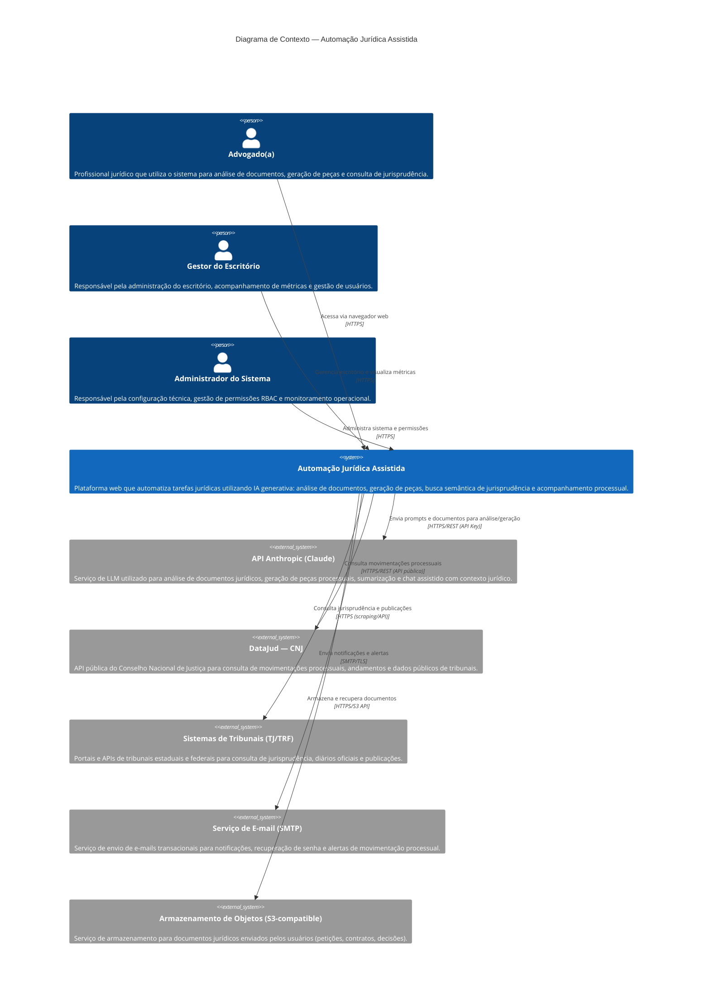

# C4 Model — Nível 1: Diagrama de Contexto

## Automação Jurídica Assistida

> Visão de mais alto nível do sistema, mostrando como ele se relaciona com usuários e sistemas externos.

---

## 1. Visão Geral

O diagrama de contexto C4 apresenta o sistema **Automação Jurídica Assistida** como uma caixa central, identificando:

- **Quem** usa o sistema (personas/atores)
- **Com quais sistemas externos** ele se integra
- **Quais são os fluxos principais** de informação

---

## 2. Diagrama de Contexto (Mermaid)



---

## 3. Catálogo de Elementos

### 3.1 Personas (Usuários)

| Persona | Descrição | Interação Principal |
|---|---|---|
| **Advogado(a)** | Profissional jurídico — usuário principal do sistema. Realiza upload de documentos, solicita análises via IA, gera peças processuais, consulta jurisprudência e acompanha processos. | Portal web autenticado (SPA React) via HTTPS |
| **Gestor do Escritório** | Responsável administrativo. Visualiza dashboards de produtividade, gerencia equipe, acompanha métricas de uso e custos de IA. | Portal web autenticado com perfil RBAC de gestor |
| **Administrador do Sistema** | Perfil técnico-administrativo. Configura integrações, gerencia permissões RBAC, monitora logs de auditoria e saúde do sistema. | Portal web autenticado com perfil RBAC de administrador |

### 3.2 Sistema Central

| Sistema | Tecnologia | Descrição |
|---|---|---|
| **Automação Jurídica Assistida** | React 18+ (frontend) / FastAPI (backend) / PostgreSQL (dados) | Plataforma web monolítica modular que automatiza tarefas jurídicas com auxílio de IA generativa. Arquitetura Clean Architecture (Ports & Adapters). |

### 3.3 Sistemas Externos

| Sistema Externo | Tipo de Integração | Protocolo | Autenticação | Descrição |
|---|---|---|---|---|
| **API Anthropic (Claude)** | REST API síncrona/streaming | HTTPS | API Key (header) | LLM para análise de documentos, geração de peças, sumarização e chat assistido. Utilizado via SDK oficial `anthropic` com retry (tenacity) e circuit breaker. |
| **DataJud — CNJ** | REST API pública | HTTPS | Chave de acesso pública | Consulta de dados processuais públicos. Implementa state machine para ciclo de vida de documentos/processos. |
| **Sistemas de Tribunais (TJ/TRF)** | REST API / Web Scraping | HTTPS | Variável por tribunal | Consulta de jurisprudência, ementas e publicações em diários oficiais. Integração heterogênea conforme disponibilidade de cada tribunal. |
| **Serviço de E-mail (SMTP)** | SMTP transacional | SMTP/TLS | Credenciais SMTP | Envio de notificações: alertas de movimentação processual, recuperação de senha, confirmação de cadastro. |
| **Armazenamento de Objetos** | S3-compatible API | HTTPS | Access Key / Secret Key | Armazenamento seguro de documentos jurídicos enviados pelos usuários. Criptografia em repouso (AES-256). |

---

## 4. Fluxos de Dados Principais

### 4.1 Análise de Documento com IA

```
Advogado(a) → [Upload documento] → Sistema → [Armazena] → Storage
                                      ↓
                              [Extrai texto e envia prompt]
                                      ↓
                              API Anthropic (Claude)
                                      ↓
                              [Retorna análise estruturada]
                                      ↓
                              Sistema → [Exibe resultado] → Advogado(a)
```

### 4.2 Acompanhamento Processual

```
Sistema (Celery worker) → [Consulta periódica] → DataJud/Tribunais
                                                      ↓
                                              [Novas movimentações?]
                                                      ↓ Sim
                                              Sistema → [Notifica] → Serviço de E-mail → Advogado(a)
```

### 4.3 Chat Assistido Jurídico

```
Advogado(a) → [Pergunta em linguagem natural] → Sistema
                                                    ↓
                                            [Monta contexto: documentos + jurisprudência]
                                                    ↓
                                            API Anthropic (Claude)
                                                    ↓
                                            [Resposta contextualizada]
                                                    ↓
                                            Sistema → Advogado(a)
```

---

## 5. Requisitos Transversais Visíveis no Contexto

| Requisito | Como se Manifesta no Contexto |
|---|---|
| **Autenticação** | Todas as personas acessam via HTTPS com JWT + MFA (TOTP). Sessões gerenciadas pelo módulo `auth`. |
| **Autorização (RBAC)** | Três perfis distintos (advogado, gestor, admin) com permissões granulares por módulo. |
| **Criptografia em trânsito** | Todas as comunicações externas via HTTPS/TLS. SMTP com TLS obrigatório. |
| **Criptografia em repouso** | Documentos no storage com AES-256. Banco de dados com criptografia de colunas sensíveis. |
| **Auditoria** | Todas as interações com sistemas externos são logadas com correlation ID (structlog). |
| **Rate Limiting** | Aplicado nas chamadas à API Anthropic (controle de custo) e nos endpoints públicos (slowapi). |
| **Resiliência** | Retry com backoff exponencial (tenacity) e circuit breaker para API Anthropic e DataJud. |
| **LGPD/Compliance** | Dados pessoais processados conforme LGPD. Logs de auditoria para rastreabilidade. Consentimento explícito para processamento por IA. |

---

## 6. Decisões Arquiteturais Relacionadas (ADRs)

| ADR | Status | Impacto no Contexto |
|---|---|---|
| **G002** — Índice vetorial (FAISS vs Milvus) | PENDENTE | Define como a busca semântica de jurisprudência será implementada. Pode adicionar um sistema externo (Milvus) ou manter interno (FAISS). |
| **G005** — Design tokens | PENDENTE | Define sistema visual do frontend. Não impacta o diagrama de contexto. |

---

## 7. Notas e Considerações

1. **Escopo do LLM**: O sistema utiliza exclusivamente a API Anthropic (Claude) como provedor de IA generativa. Não há dependência de outros provedores de LLM no momento.

2. **DataJud como fonte primária**: A integração com o DataJud do CNJ é a fonte primária para dados processuais. Integrações diretas com tribunais são complementares e podem ser adicionadas incrementalmente.

3. **Armazenamento de objetos**: A escolha específica do provedor (AWS S3, MinIO, etc.) é uma decisão de infraestrutura. O sistema utiliza interface S3-compatible para manter portabilidade.

4. **Evolução para microserviços**: A arquitetura de monólito modular permite que módulos sejam extraídos como serviços independentes no futuro, caso a escala justifique. O diagrama de contexto permaneceria o mesmo — apenas o diagrama de containers (C4 nível 2) mudaria.

---

## 8. Referências

- [C4 Model — Simon Brown](https://c4model.com/)
- [Mermaid C4 Diagrams](https://mermaid.js.org/syntax/c4.html)
- [DataJud — CNJ](https://datajud-wiki.cnj.jus.br/)
- [Anthropic API Documentation](https://docs.anthropic.com/)

---

> **Última atualização**: Gerado durante o scaffold inicial do projeto.  
> **Próximo nível**: Ver `docs/architecture/c4-containers.md` para o diagrama de containers (C4 nível 2).
